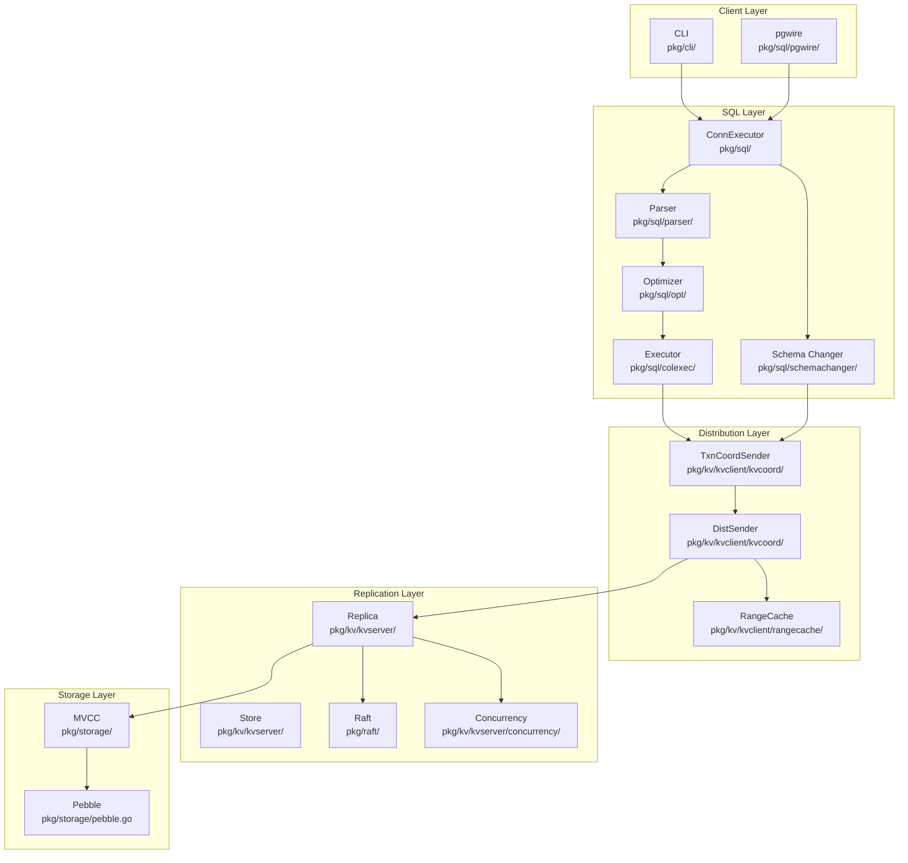
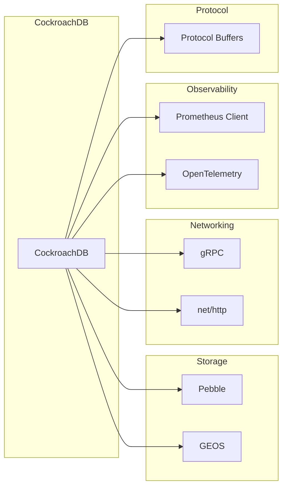

# CockroachDB Dependency Graph

**Commit SHA:** `6ca473a526d30cccd2d55ea87a6bf4bd22db3e40`

---

## Layer Dependencies



## Package Dependency Flow

### SQL Processing Path

```
pkg/sql/parser/
    │
    ▼
pkg/sql/sem/tree/          (AST definitions)
    │
    ▼
pkg/sql/opt/optbuilder/    (AST → Memo)
    │
    ▼
pkg/sql/opt/norm/          (Normalization)
    │
    ▼
pkg/sql/opt/xform/         (Exploration)
    │
    ▼
pkg/sql/opt/exec/execbuilder/  (Memo → Plan)
    │
    ├──▶ pkg/sql/colexec/   (Columnar execution)
    │
    └──▶ pkg/sql/rowexec/   (Row execution)
```

### Transaction Processing Path

```
pkg/kv/txn.go
    │
    ▼
pkg/kv/kvclient/kvcoord/txn_coord_sender.go
    │
    ├── txn_interceptor_heartbeater.go
    ├── txn_interceptor_seq_num_allocator.go
    ├── txn_interceptor_pipeliner.go
    ├── txn_interceptor_span_refresher.go
    └── txn_interceptor_committer.go
    │
    ▼
pkg/kv/kvclient/kvcoord/dist_sender.go
    │
    ▼
pkg/kv/kvserver/replica.go
    │
    ▼
pkg/kv/kvserver/batcheval/  (Command evaluation)
    │
    ▼
pkg/storage/mvcc.go
```

## External Dependencies

### Core Dependencies



### Key Go Dependencies

| Dependency | Purpose | Package |
|------------|---------|---------|
| `google.golang.org/grpc` | Inter-node RPC | `pkg/rpc/` |
| `github.com/prometheus/client_golang` | Metrics export | `pkg/util/metric/` |
| `go.opentelemetry.io/otel` | Distributed tracing | `pkg/util/tracing/` |
| `github.com/gogo/protobuf` | Serialization | Throughout |
| `golang.org/x/sync` | Concurrency primitives | `pkg/util/` |
| `github.com/cockroachdb/errors` | Error handling | Throughout |
| `github.com/cockroachdb/pebble` | Storage engine | `pkg/storage/` |

### C/C++ Dependencies

| Dependency | Purpose | Location |
|------------|---------|----------|
| Pebble | LSM-tree storage | Vendored |
| GEOS | Geospatial operations | `c-deps/` |
| libc | System calls | Toolchain |

## Internal Package Dependencies

### Utility Dependencies (pkg/util/)

Most packages depend on these utilities:

```
pkg/util/
├── log/            → Used by: ALL packages
├── metric/         → Used by: server, kv, sql
├── tracing/        → Used by: ALL packages
├── mon/            → Used by: sql, kv
├── encoding/       → Used by: storage, kv, sql
├── syncutil/       → Used by: kv, storage
├── timeutil/       → Used by: ALL packages
├── uuid/           → Used by: kv, sql
└── stop/           → Used by: server, kv
```

### Protocol Buffer Dependencies (pkg/roachpb/)

Core types used throughout:

```
pkg/roachpb/
├── api.proto       → BatchRequest, BatchResponse
├── data.proto      → Key, Value, Transaction
├── metadata.proto  → RangeDescriptor, NodeDescriptor
└── errors.proto    → Error types
```

## Cross-Layer Dependencies

### SQL → KV Interface

```go
// pkg/kv/txn.go:71
type Txn struct {
    db      *DB
    sender  TxnSender
    // ...
}

// Used by SQL executor
func (txn *Txn) Put(ctx context.Context, key, value interface{}) error
func (txn *Txn) Get(ctx context.Context, key interface{}) (KeyValue, error)
func (txn *Txn) Scan(ctx context.Context, begin, end interface{}, maxRows int64) ([]KeyValue, error)
```

### KV → Storage Interface

```go
// pkg/storage/engine.go:921
type Engine interface {
    Reader
    Writer
    // ...
}

// pkg/storage/mvcc.go
func MVCCPut(ctx context.Context, rw ReadWriter, ms *enginepb.MVCCStats,
    key roachpb.Key, timestamp hlc.Timestamp, localTimestamp hlc.ClockTimestamp,
    value roachpb.Value, txn *roachpb.Transaction) error
```

## Circular Dependency Prevention

CockroachDB uses several strategies to avoid circular dependencies:

### 1. Interface Segregation
```
pkg/kv/kvclient/kvcoord/  → Defines Sender interface
pkg/kv/kvserver/          → Implements interface
```

### 2. Callback Registration
```go
// Registration at startup
server.RegisterCallback(callback)

// Later invocation
server.InvokeCallbacks()
```

### 3. Separate Protocol Packages
```
pkg/roachpb/    → Shared types
pkg/kvpb/       → KV-specific types
pkg/sql/execinfrapb/  → Execution types
```

## Build Dependency Graph

### Bazel Build Order

```
//pkg/util/log             # Base logging
//pkg/util/metric          # Metrics (depends on log)
//pkg/util/tracing         # Tracing (depends on log)
//pkg/roachpb              # Protocol buffers
//pkg/storage              # Storage (depends on roachpb)
//pkg/kv/kvserver          # KV server (depends on storage)
//pkg/kv/kvclient          # KV client (depends on kvserver)
//pkg/sql                  # SQL (depends on kv)
//pkg/server               # Server (depends on sql, kv)
//pkg/cli                  # CLI (depends on server)
//pkg/cmd/cockroach        # Main binary
```

### Code Generation Dependencies

```
.proto files
    │
    ▼
protoc + gogo/protobuf → *.pb.go
    │
    ▼
optgen rules → optimizer code
    │
    ▼
execgen templates → vectorized operators
    │
    ▼
sql.y grammar → parser
```

## Version Compatibility

### Mixed-Version Dependencies

CockroachDB maintains compatibility across versions:

```
pkg/clusterversion/     # Version definitions
pkg/upgrade/            # Upgrade migrations
pkg/sql/catalog/        # Schema versioning
```

### Feature Gating

```go
// Check version before using feature
if version.IsActive(ctx, clusterversion.V24_1) {
    // Use new feature
}
```

---

## Dependency Management

### Go Modules
- Primary: `go.mod`
- Checksum: `go.sum`
- Bazel: `DEPS.bzl`

### Updating Dependencies
```bash
# Update go.mod
go get -u dependency@version

# Regenerate Bazel files
./dev generate bazel
```

### Dependency Review Checklist
- [ ] Security vulnerabilities
- [ ] License compatibility
- [ ] Maintenance status
- [ ] Performance impact
- [ ] Binary size impact
